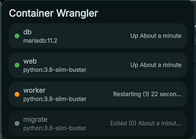

# Dank Material Shell Plugins

A plugin registry for [Dank Material Shell](https://github.com/AvengeMedia/DankMaterialShell).

> **Note:** The official DMS plugin registry is [AvengeMedia/dms-plugin-registry](https://github.com/AvengeMedia/dms-plugin-registry). This repo follows the same plugin JSON schema.

## Structure

- `plugins/` — one JSON file per plugin, named `{github-username}-{plugin-name}.json`. See [CONTRIBUTING.md](CONTRIBUTING.md) for the full schema.
- `plugins-src/` — source for plugins authored in this repo, one folder per plugin.
- `.plans/` — one planning doc per slice of work. See [.docs/DESIGN.md](.docs/DESIGN.md).
- `.docs/` — cross-cutting design notes and conventions.

Themes are not supported here yet.

## Using this registry

DMS supports additional plugin registries alongside the official one. Add this repo with the `dms` CLI:

```bash
dms registry add dank-dms-plugins https://github.com/kennycrous/dank-dms-plugins.git
```

Then browse/install plugins as usual via the Settings UI or `dms plugins install {plugin-name}`. See `dms registry list` / `dms registry remove` to manage registries.

## Container Wrangler

<!-- TODO: add screenshot of the popout, e.g.  -->
*Screenshot placeholder*

A DankBar widget that shows your Docker containers without opening a terminal. Click the bar icon to open a popout listing every container, running or stopped, with its image and status text (for example `Up 3 hours`). Containers are sorted running first, then restarting, then stopped, and the list refreshes every 5 seconds while the popout is open.

It runs plain `docker ps -a` and lets the docker CLI pick the endpoint (`DOCKER_HOST`, `DOCKER_CONTEXT`, current context, default socket), so the popout matches what you'd see in a terminal. If the daemon can't be reached it says "Docker not reachable" rather than showing an empty list. Version 1 is visibility only: no start/stop/restart, logs, exec or Compose view yet. A running-count badge on the bar icon is planned (see [`.plans/container-wrangler-002-running-badge.md`](.plans/container-wrangler-002-running-badge.md)).

### Install

Requires DankMaterialShell and the `docker` CLI on your `PATH`, with permission to reach the daemon (usually membership of the `docker` group).

```bash
dms registry add dank-dms-plugins https://github.com/kennycrous/dank-dms-plugins.git
dms plugins install containerWrangler
```

Then enable **Container Wrangler** in Settings → Plugins and add it to DankBar. More detail in [`plugins-src/containerWrangler/README.md`](plugins-src/containerWrangler/README.md).

### How this was built

Container Wrangler was built with an AI-assisted spec → plan → PR workflow, with the plan documents kept in the repo as the record of what was decided and why.

- **Plan first.** Each slice of work gets a file in [`.plans/`](.plans/), named `<feature>-<NNN>-<slice>.md`, with a summary, scope, draft manifest, test approach and a checklist of atomic commits. [`container-wrangler-001-first-slice.md`](.plans/container-wrangler-001-first-slice.md) is the shipped v1; [`002`](.plans/container-wrangler-002-running-badge.md) is the next slice, still an idea.
- **Plans change when reality does.** The first slice started Colima-only, then went runtime-neutral when the dev machine turned out to run native Docker, then dropped Colima entirely (DMS is Linux-only, where Docker runs natively), then stopped resolving sockets and let the docker CLI do it. Each change is recorded in the plan as a dated scope change, and the earlier checked steps are left as history.
- **Atomic commits, tests first.** One commit per plan step, with the failing test written before the code. Parsing and view-model logic lives in plain `.js` files under `lib/` that load from both QML and Node, so it is covered by `node --test` with no test framework. The QML itself is verified by hand in DMS, and the plan says so explicitly.
- **Conventions live in [`.docs/`](.docs/).** [`DESIGN.md`](.docs/DESIGN.md) covers the monorepo layout, how a registry entry points back at this repo with a `path`, and the testing split. [`FUTURE_FEATURES.md`](.docs/FUTURE_FEATURES.md) is the parking lot for ideas that don't yet deserve a plan.

## Contributing

Open a pull request adding your plugin's JSON file to `plugins/`. See [CONTRIBUTING.md](CONTRIBUTING.md) for the schema and guidelines.

## Disclaimer

Plugins listed here are created and maintained by third-party developers and are not officially supported by the Dank Material Shell team. Use them at your own risk. In case of issues, please contact the plugin author directly.
